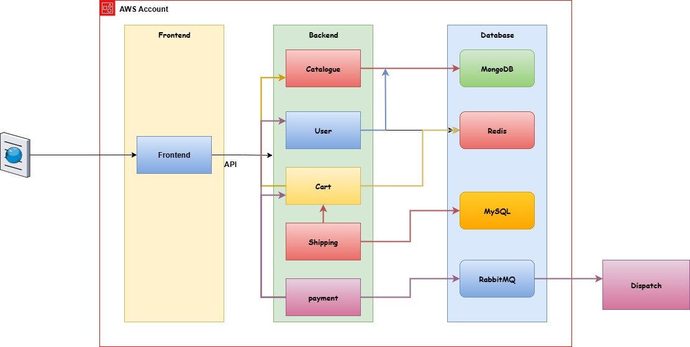

# 🛒 Roboshop Shell Automation

This repository contains **Bash scripts to automate the deployment of Roboshop microservices**. These scripts simplify service setup, dependency installation, database configuration, and logging.

---

## 📂 Repository Structure

| File | Service / Purpose | Description |
|------|-----------------|-------------|
| `roboshop.sh` | Orchestrator | Main script to run individual microservice scripts. |
| `payment.sh` | Payment | Deploys Payment microservice (Python). |
| `payment.service` | Payment | Systemd service file for Payment service. |
| `cart.sh` | Cart | Deploys Cart microservice. |
| `cart.service` | Cart | Systemd service file for Cart service. |
| `catalogue.sh` | Catalogue | Deploys Catalogue microservice (NodeJS). |
| `mongo.repo` | Catalogue | MongoDB yum repository configuration. |
| `mongodb.sh` | MongoDB | Installs and configures MongoDB. |
| `mysql.sh` | MySQL | Installs and configures MySQL. |
| `frontend.sh` | Frontend | Deploys Frontend microservice. |
| `nginx.conf` | Frontend | Nginx configuration file. |
| `rabbitmq.sh` | RabbitMQ | Installs and configures RabbitMQ. |
| `rabbitmq.repo` | Frontend | RabbitMQ yum repository configuration. |
| `redis.sh` | Redis | Installs and configures Redis. |
| `shipping.sh` | Shipping | Deploys Shipping microservice. |
| `shipping.service` | Shipping | Systemd service file for Shipping service. |
| `user.sh` | User | Deploys User microservice. |
| `user.service` | User | Systemd service file for User service. |

---

## 🌐 Microservices Architecture

Here is a visual representation of the Roboshop microservices setup:



**Explanation of interactions:**

1. **Frontend** communicates with **Cart** and **Catalogue** services to fetch products and handle orders.  
2. **Cart** relies on **Redis** for caching and **Catalogue** for product info.  
3. **Payment** interacts with **MySQL** for storing transactions.  
4. **Shipping** listens to events from **RabbitMQ** to process deliveries.  
5. **Catalogue** service fetches product data from **MongoDB**.  

---

## ⚙️ Features

- ✅ Automates setup of all Roboshop microservices.  
- ✅ Installs dependencies: NodeJS, Python, MongoDB, MySQL, Redis, RabbitMQ.  
- ✅ Creates system users and app directories.  
- ✅ Configures services with systemd for auto-start.  
- ✅ Loads initial database data if not present.  
- ✅ Logs all actions to `/var/log/shell-roboshop`.  
- ✅ Fail-safe execution with `set -euo pipefail` and error trapping.  

---

## 🚀 Usage

1. Clone the repository:
   ```bash
   git clone https://github.com/GorleJansi/shell-roboshop.git
   cd roboshop-shell

2. Make scripts executable:
   ```bash
   chmod +x *.sh


3. Run the main orchestrator (example for MongoDB services):
   ```bash
   sudo ./roboshop.sh mongodb

4. Check logs:
   ```bash
   tail -f /var/log/shell-roboshop/<script_name>.log


🔧 Requirements

Linux system (CentOS/RHEL/Fedora recommended)

Root privileges

Internet connectivity for S3 artifact downloads

📌 Notes

Scripts are idempotent; re-running will skip already configured steps

Error trapping prints line number and command for easier debugging

Designed for learning and DevOps practice
